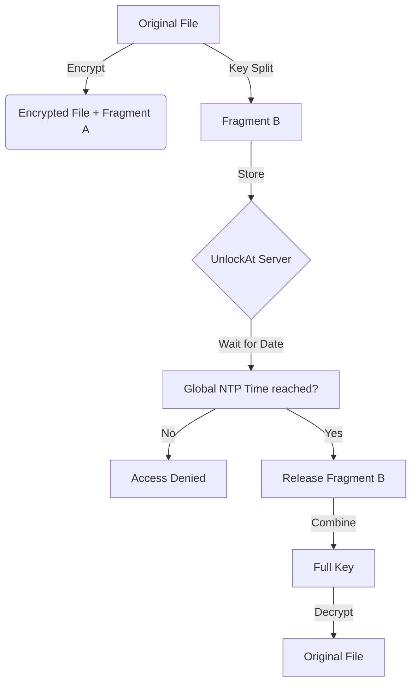

<div align="center">

# 🔓 UNLOCKAT
### Secure, Time-Gated File Encryption

[](https://opensource.org/licenses/MIT)
[](#)
[](#)

**UnlockAt is a zero-knowledge file protection system where the security parameter is TIME.**  
Files are encrypted locally and remain inaccessible until a specific global timestamp is reached.

</div>

---

## 🛑 The Problem
Standard file locks depend on passwords that can be shared or system clocks that can be faked. If you change your PC date from 2026 to 2030, most software-based "time-locks" fail instantly because they trust your local machine's clock.

## 🛡️ The UnlockAt Solution
UnlockAt solves this by splitting the decryption key and relying on **Atomic Global Time**.

1.  **Local Encryption**: Your file never leaves your computer.
2.  **Key Fragmentation**: The encryption key is split into two fragments:
    -   **Fragment A**: Stored locally with your encrypted file.
    -   **Fragment B**: Sent to the UnlockAt secure server.
3.  **Time Gating**: The server uses **Network Time Protocol (NTP)** to fetch Global Atomic Time. It will physically refuse to release Fragment B until the target date is reached.

---

## 🏗️ Architecture


---

## ✨ Key Features

-   **Zero-Knowledge**: The server never sees your file or your full encryption key.
-   **Anti-Tamper**: Changing your system hardware clock has zero effect on the unlock time.
-   **Permanent**: Once locked, the server physically cannot release the key early. Even an admin cannot "force" it open.
-   **Multi-Platform**: Access via a sleek **Drag-and-Drop Web App** or a powerful **CLI Tool**.

---

## ⌨️ How to Use (CMD)

### Lock a file
Encrypt a file until a specific date and time.
```bash
unlockat lock secret.pdf "2027-01-01 12:00:00"
# Generated: secret.pdf.unlockat
```

### Open a file
Attempt to retrieve the server-side fragment and decrypt.
```bash
unlockat open secret.pdf.unlockat
# Status: Locked. 342 days remaining.
```

---

## 🌐 Web App
UnlockAt features a premium web interface for those who prefer a visual workflow. Just drag your file, set the date, and download your secure archive.

---

## 🔒 Security & Privacy
UnlockAt employs **AES-256-GCM** encryption. Since Fragment B is only released after the time gate, and Fragment A is needed to combine with B, your data is cryptographically secure against both local and remote attackers.

---

<div align="center">
Built with ❤️ for Privacy.
</div>
